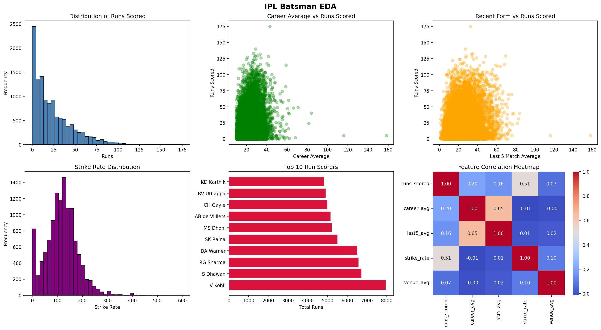
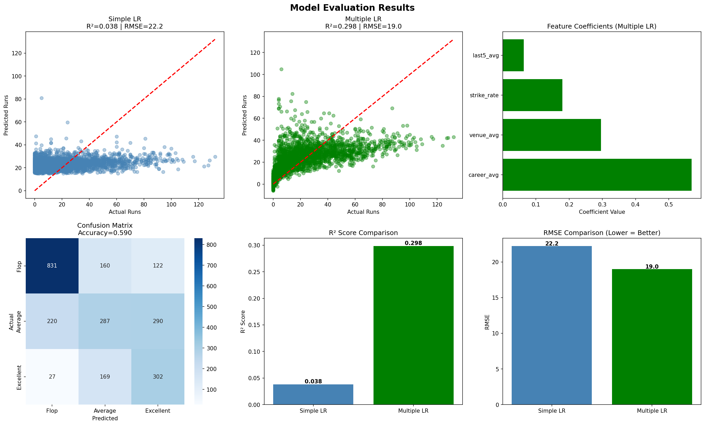

# 🏏 IPL Batsman Run Predictor

**Course:** Predictive Analytics 2025-26
**Team Members:** Adithyan Biju | Fidal Govind | Archana Das
**Live App:** [Click Here](YOUR_STREAMLIT_URL_HERE)

---

## 🎯 Problem Statement
Predicting how many runs an IPL batsman will score in their
next match is a challenging yet valuable problem in sports
analytics. This project uses historical IPL batting statistics
to build machine learning models that predict batting
performance.

---

## 📦 Dataset
- **Source:** Kaggle IPL Complete Dataset 2008-2020
- **Files:** deliveries.csv + matches.csv
- **Total Records:** 179,000+ ball by ball deliveries
- **Matches Covered:** 800+ IPL matches
- **Seasons:** 2008 to 2020

---

## 🔧 Features Used
| Feature | Description |
|---------|-------------|
| career_avg | Batsman's overall career batting average |
| last5_avg | Average runs in last 5 matches (recent form) |
| strike_rate | Scoring speed (runs per 100 balls) |
| venue_avg | Average score at that ground |

---

## 🤖 Models Built
| Model | Type | R² | RMSE | MAE |
|-------|------|----|------|-----|
| Simple Linear Regression | Regression | 0.038 | 22.23 | 17.34 |
| Multiple Linear Regression | Regression | 0.298 | 18.99 | 13.68 |
| Logistic Regression | Classification | Acc: 0.590 | — | — |

---

## 📊 Data Science Life Cycle
| Stage | Description | Status |
|-------|-------------|--------|
| 1 | Problem Definition & Literature Review | ✅ |
| 2 | Data Collection & Understanding | ✅ |
| 3 | Data Preprocessing & Cleaning | ✅ |
| 4 | Exploratory Data Analysis | ✅ |
| 5 | Feature Engineering & Selection | ✅ |
| 6 | Model Building & Training | ✅ |
| 7 | Model Evaluation & Comparison | ✅ |
| 8 | Model Interpretation & Explainability | ✅ |
| 9 | Deployment | ✅ |
| 10 | Documentation | ✅ |

---

## 📈 EDA Charts


---

## 📊 Model Results


---

## 👥 Team Contributions
| Member | GitHub | Stages Covered |
|--------|--------|---------------|
| Adithyan Biju | adithyanbijuds25-eng | Stages 1,2,3,4,5,10 |
| Fidal Govind | fidalgovindduk | Stages 6,7,8 |
| Archana Das | archanatds25 | Stages 9,10 |

---

## 🛠️ Tech Stack
- Python
- Pandas
- Scikit-learn
- Matplotlib
- Seaborn
- Streamlit
- GitHub

---

## 🚀 How to Run Locally
```bash
pip install -r requirements.txt
streamlit run streamlit_app.py
```

---

## 🌐 Live Deployment
[Click here to open the live app](YOUR_STREAMLIT_URL_HERE)

---

## 📁 Repository Structure
```
IPL-Run-Predictor/
├── data/
│   ├── cleaned_data.csv
│   └── eda_charts.png
├── models/
│   ├── multiple_lr.pkl
│   ├── logistic_model.pkl
│   └── scaler.pkl
├── notebooks/
│   ├── 01_data_cleaning.ipynb
│   └── 03_modelling.ipynb
├── individual_profiles/
├── presentation/
│   └── IPL_Run_Predictor.pptx
├── streamlit_app.py
└── requirements.txt
```
